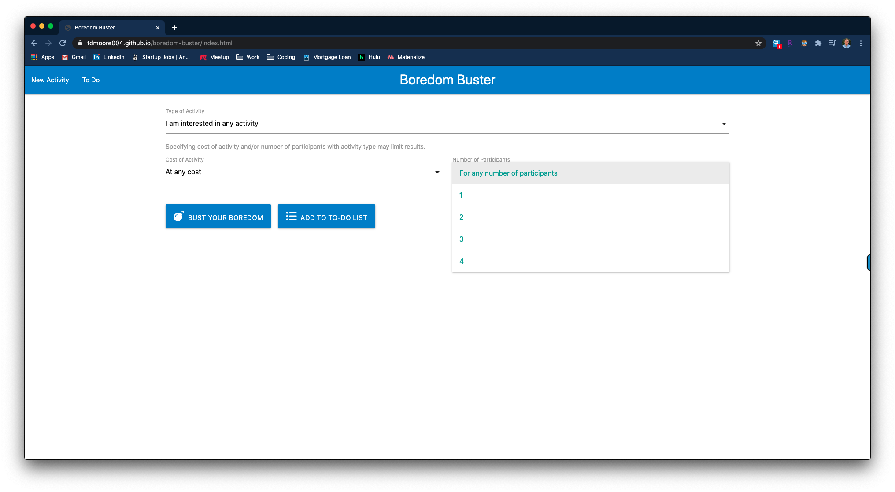
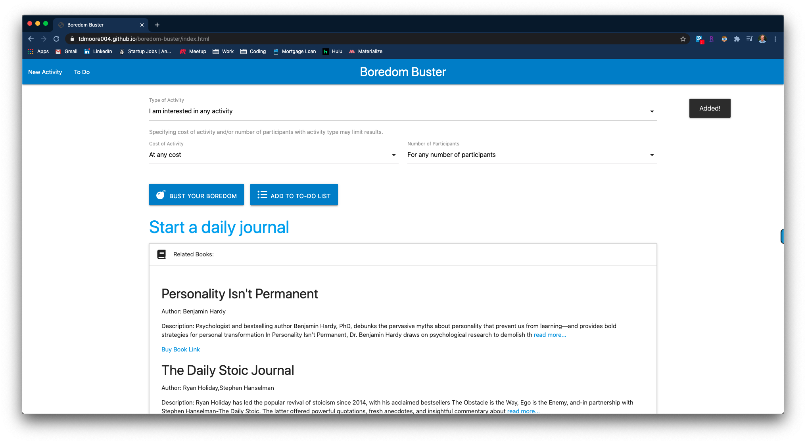
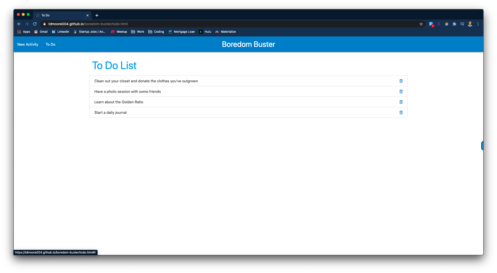

# Boredom Buster
__https://tdmoore004.github.io/boredom-buster/__

## Description
If you are bored and looking for something to do, this site will help you quench your thirst. Use boredom buster to generate an activity, and save your activities in a to-do list to keep your boredom organized.

## How it works

As you come to the start screen, you can choose any criteria you'd like for your activity.

When you click the __Bust your Boredom__ button, you will be presented with an activity and a list of books related to your activity. Click on the __Add to todo list__ button to add your activity to your todo list.

Navigate to the To Do page to see your list of activities. Click on the trash icon to remove your activity from the list when you've completed it.